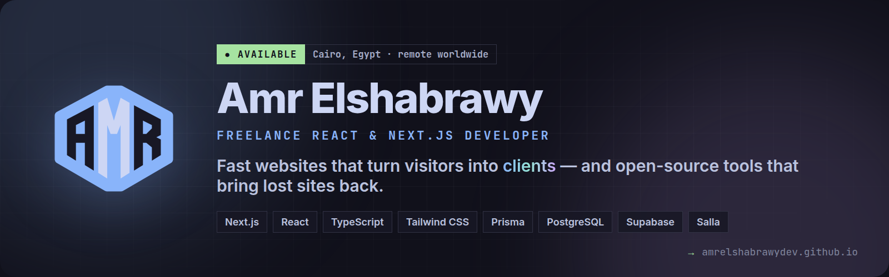

  

  

---

## 👋 Hi, I'm Amr

I'm a **freelance React & Next.js developer** from Egypt 🇪🇬 with **4+ years** of shipping real work for clients in Egypt, the Gulf and worldwide.

I don't just build interfaces — I build websites that **load fast, rank on Google and bring in customers**: business sites, online stores (Next.js and Salla), dashboards, and WordPress-to-Next.js migrations that keep their rankings. When something breaks in production — payments, hydration, SEO — I'm the person who digs in and fixes it.

- 🛒 **E-commerce** — custom Next.js storefronts and stores on **Salla, Zid, Shopify & WooCommerce**
- ⚡ **Performance & SEO** — Core Web Vitals, technical SEO, structured data; real PageSpeed scores, not promises
- 🧱 **Full-stack when needed** — Prisma, PostgreSQL, Supabase, payments (Stripe, PayPal, Paddle)
- 🌍 **Arabic & English** — RTL done right, from the URL slugs to the checkout
- 🛠️ **Open source** — turning problems I solve for clients into tools anyone can use

> *"الطريق إلى الإتقان لا نهاية له"* — the path to mastery never ends. Every project is a new chapter.

---

## 🛠️ Open Source

<table>
<tr>
<td width="50%" valign="top">

### [wayback-restore](https://github.com/AmrElshabrawyDev/wayback-restore) &nbsp;🆕

**Your website is gone. Its content doesn't have to be.**

Recovers a lost website's posts and images from the Internet Archive — original URLs, SEO data and Arabic slugs intact — and exports them to Supabase, Prisma, SQL, MongoDB, Markdown or WordPress. Born from a real client rescue: **182 articles brought back** after their database was destroyed.

`Node.js` · `CLI` · `Interactive mode` · **Contributions welcome 🤝**

</td>
<td width="50%" valign="top">

### [Rich Black — VS Code Theme](https://marketplace.visualstudio.com/items?itemName=rich-black-theme.amr-rich-black-theme)

A deep-black, high-contrast theme designed for long coding sessions — easy on the eyes, sharp on syntax.

`VS Code` · `Theme` · [Install from the Marketplace →](https://marketplace.visualstudio.com/items?itemName=rich-black-theme.amr-rich-black-theme)

</td>
</tr>
</table>

---

## 💼 Featured Client Work

| Project | What I did | Stack | Result |
|---|---|---|---|
| **[Kosovo Travels](https://amrelshabrawydev.github.io/work/kosovo-travels)** — travel & booking platform | Fixed Stripe & PayPal payments on the Edge runtime, SSR/hydration bugs, security headers & SEO | Next.js 16 · Cloudflare | **97** desktop PageSpeed |
| **[Al-Amal Moving](https://amrelshabrawydev.github.io/work/al-amal-furniture-moving-kuwait)** — Kuwait lead-generation site | Rebuilt a crashed WordPress site, recovered **182 articles** at their original URLs, price calculator & admin panel | Next.js 16 · Supabase | **100** desktop PageSpeed |
| **[ToNextStep](https://amrelshabrawydev.github.io/work/tonextstep-digital-marketplace)** — digital products marketplace | Full-stack marketplace: catalog, checkout, licenses, secure downloads, admin | Next.js 16 · Prisma · PostgreSQL · Paddle | **94** desktop PageSpeed |
| **[Luxellia Parfums](https://amrelshabrawydev.github.io/work/luxellia-parfums-salla-store)** — luxury perfume store | Custom Arabic (RTL) Salla theme, interactive preview, catalog tooling | Salla Twilight · Node.js | Luxury brand identity |

**[→ See all case studies with screenshots & PageSpeed reports](https://amrelshabrawydev.github.io/work)**

---

## ✍️ Latest Articles

<ul>
  <li dir="rtl">🇸🇦 <a href="https://amrelshabrawydev.github.io/blog/wordpress-to-nextjs-arabic-migration">تحويل موقع ووردبريس إلى <bdi>Next.js</bdi> دون أن تخسر ترتيبك في جوجل</a></li>
  <li>🛒 <a href="https://amrelshabrawydev.github.io/blog/salla-vs-custom-nextjs-store">Salla vs a Custom Next.js Store: Which One Fits Your Brand?</a></li>
  <li dir="rtl">🇸🇦 <a href="https://amrelshabrawydev.github.io/blog/salla-store-mistakes">&rlm;7 أخطاء في متاجر سلة تقلل المبيعات (وكيف تصلحها)</a></li>
  <li>🔁 <a href="https://amrelshabrawydev.github.io/blog/wordpress-to-nextjs-migration-seo">WordPress to Next.js Migration Without Losing SEO</a></li>
  <li>💰 <a href="https://amrelshabrawydev.github.io/blog/nextjs-website-cost">How Much Does a Next.js Website Cost in 2026?</a></li>
</ul>

**[→ Read all articles](https://amrelshabrawydev.github.io/blog)** · [RSS](https://amrelshabrawydev.github.io/rss.xml)

---

## 🧰 Tech Stack

**Frameworks & languages**  

**UI, styling & motion**  

**Data, payments & platforms**  

**Workflow & delivery**  

Also: GSAP · Framer Motion · Stripe · PayPal · Paddle · Resend · Salla · Zid · Shopify · WooCommerce

---

## 🎯 Where I'm Heading

This profile is a work in progress — and so am I. Here's what I'm building toward:

- [x] 🌐 Launch a portfolio that shows **real problems, real solutions and real results**
- [x] 🛠️ Release my first open-source tool — **[wayback-restore](https://github.com/AmrElshabrawyDev/wayback-restore)**
- [ ] 📦 Grow wayback-restore to **v1.0**: Blogger, Ghost, Wix and online stores (Shopify, Salla, Zid)
- [ ] ✍️ Publish **two articles a month** — in Arabic and English — about Next.js, SEO and e-commerce
- [ ] 🇸🇦 Open-source an **Arabic-first Next.js starter** (RTL, SEO and structured data built in)
- [ ] 🤝 Mentor developers starting their freelance journey, the way others helped me
- [ ] 🌍 Partner with teams and agencies worldwide on products that matter

---

## 📊 GitHub Insights

---

## 🌐 Let's Connect

Have a project in mind, a site that needs rescuing, or just want to talk code? 
**I reply within 24 hours** — in Arabic or English.

 

 

Made with 💙 and ☕ in Egypt by <a href="https://amrelshabrawydev.github.io"><strong>Amr Elshabrawy</strong></a> · Freelance React &amp; Next.js Developer 
© 2026 · Keep building 🚀

